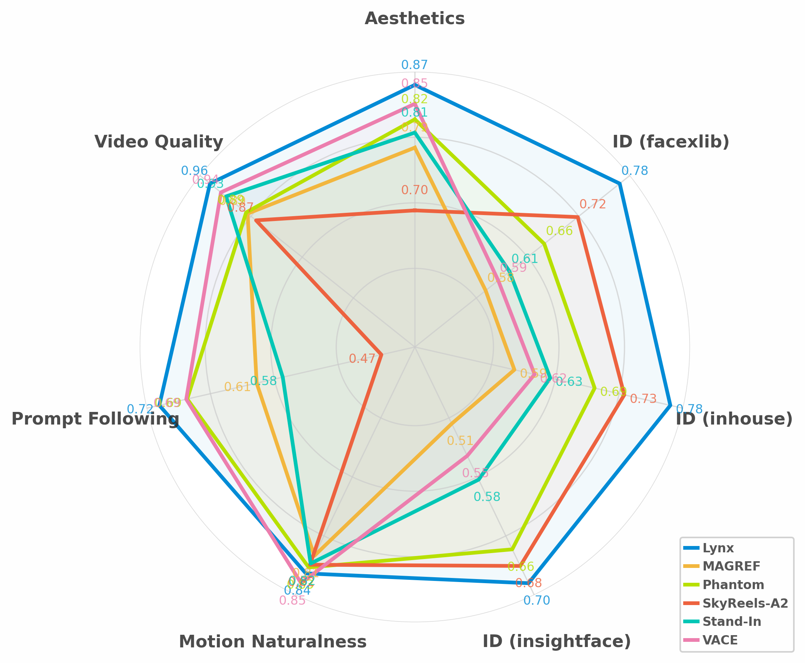

<div align="center">

# Lynx: Towards High-Fidelity Personalized Video Generation

<h5 style="font-size: 1.1em; letter-spacing: 0.5px;">
  <a href="https://ssangx.github.io/" style="margin-right: 20px;">Shen Sang*</a>
  <a href="https://tiancheng-zhi.github.io/" style="margin-right: 20px;">Tiancheng Zhi*</a>
  <a href="https://gutianpei.github.io/" style="margin-right: 20px;">Tianpei Gu</a>
  <a href="https://www.jingliu.net/" style="margin-right: 20px;">Jing Liu</a>
  <a href="https://linjieluo.github.io/">Linjie Luo</a>
</h5>

<p style="font-size: 1.05em; margin: 8px 0;">
Intelligent Creation, ByteDance
</p>

<p style="font-size: 0.95em; font-style: italic;">
* Equal Contribution
</p>

[](https://arxiv.org/abs/2509.15496)
[](https://byteaigc.github.io/Lynx/)
[](https://huggingface.co/ByteDance/lynx)


<div align="center">

 

</div>

</div>
Lynx is a high-fidelity video generation model for personalized video synthesis from a single input image. Built on a Diffusion Transformer (DiT) foundation model with lightweight ID-adapters and Ref-adapters for identity preservation and spatial detail enhancement.


## Installation

### Dependencies
Tested on CUDA 12.4
```bash
conda create -n lynx python=3.10
conda activate lynx
pip install -r requirements.txt

# For lynx full model, flash attention is required
pip install flash_attn==2.7.4.post1 # flash attention 3 is also supported, will be faster
```

### Model Download

- Base model: Download from [Wan-AI/Wan2.1-T2V-14B-Diffusers](https://huggingface.co/Wan-AI/Wan2.1-T2V-14B-Diffusers), place it at `models/Wan2.1-T2V-14B-Diffusers`
- Lynx: Download `lynx_full` from [ByteDance/lynx](https://huggingface.co/ByteDance/lynx), place it at `models/lynx_full`
- Lynx-lite: Download `lynx_lite` from [ByteDance/lynx](https://huggingface.co/ByteDance/lynx), place it at `models/lynx_lite`


## Full Model

Complete version with all advanced features and best performance.

### Usage

**Run a simple single-GPU inference:**
```bash
python infer.py --subject_image demo/subjects/demo_subject.png --prompt "A person carves a pumpkin on a porch in the evening. The camera captures their upper body as they draw a face with a marker, carefully cut along the lines, then lift the lid with both hands. Their face lights up with excitement as they peek inside." --seed 42

python infer.py --subject_image demo/subjects/demo_subject.png --prompt demo/prompts/demo_prompt.txt --seed 42
```

## Lite Model

Lightweight version optimized for resource-constrained environments, with 24 fps video support.

### Usage

**Run a simple single-GPU inference:**
```bash
python infer_lite.py --subject_image demo/subjects/demo_subject.png --prompt "A person carves a pumpkin on a porch in the evening. The camera captures their upper body as they draw a face with a marker, carefully cut along the lines, then lift the lid with both hands. Their face lights up with excitement as they peek inside." --seed 42

python infer_lite.py --subject_image demo/subjects/demo_subject.png --prompt demo/prompts/demo_prompt.txt --seed 42
```

## License
```
Copyright 2025 Bytedance Ltd. and/or its affiliates

Licensed under the Apache License, Version 2.0 (the "License");
you may not use this file except in compliance with the License.
You may obtain a copy of the License at

    http://www.apache.org/licenses/LICENSE-2.0

Unless required by applicable law or agreed to in writing, software
distributed under the License is distributed on an "AS IS" BASIS,
WITHOUT WARRANTIES OR CONDITIONS OF ANY KIND, either express or implied.
See the License for the specific language governing permissions and
limitations under the License.
```

## Citation
If you find this code useful for your research, please cite us via the BibTeX below.
```BibTeX
@article{sang2025lynx,
  title        = {Lynx: Towards High-Fidelity Personalized Video Generation},
  author       = {Sang, Shen and Zhi, Tiancheng and Gu, Tianpei and Liu, Jing and Luo, Linjie},
  journal      = {arXiv preprint arXiv:2509.15496},
  year         = {2025}
}
```